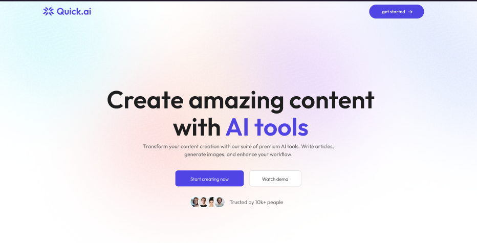

<div align="center">
  <br />
  
  <br /><br />
  <div>
    
    
    
    
    
    
    
    
    
    
    
    
    
    
  </div>
</div>

# 🚀 QuickAI

QuickAI is a full-stack AI-powered content creation platform that enables users to generate articles, blog titles, images, and more using advanced AI tools. The application features a modern React frontend and a Node.js/Express backend, integrating services like Clerk for authentication, Cloudinary for image management, and NeonDB for data storage.

## ✨ Features

- **AI Article Writer**: Generate high-quality articles on any topic.
- **Blog Title Generator**: Create catchy blog titles using AI.
- **AI Image Generation**: Produce stunning visuals from text prompts.
- **Background & Object Removal**: Edit images with AI-powered tools.
- **Resume Reviewer**: Get AI-driven feedback on your resume.
- **Community Gallery**: Share and discover public creations.
- **User Dashboard**: Track your content and plan usage.
- **Premium Plan Support**: Unlock advanced features with a subscription.

## 🛠️ Tech Stack

### 🖥️ Frontend

- **React**: Component-based UI library for building interactive interfaces.
- **Vite**: Fast build tool and development server for modern web projects.
- **Tailwind CSS**: Utility-first CSS framework for rapid UI development.
- **Clerk**: Authentication and user management.
- **Axios**: Promise-based HTTP client for API requests.
- **React Router**: Declarative routing for React applications.

### ⚙️ Backend

- **Node.js**: JavaScript runtime for server-side development.
- **Express.js**: Minimal and flexible Node.js web application framework.
- **NeonDB (PostgreSQL)**: Cloud-native PostgreSQL database for persistent storage.
- **Cloudinary**: Cloud-based image and video management.
- **OpenAI API**: AI-powered text and image generation.
- **ClipDrop API**: AI-powered image editing (background/object removal).
- **Clerk**: Authentication and user management integration.
- **Multer**: Middleware for handling file uploads.
- **dotenv**: Loads environment variables from `.env` files.

### 🚀 DevOps & Deployment

- **Vercel**: Cloud platform for static sites and serverless functions.
- **ESLint**: Linting utility for maintaining code quality.
- **Git**: Version control system.

### 🧰 Other Tools

- **Cloudinary SDK**: For image upload and transformation.
- **JWT**: For secure authentication and authorization.
- **CORS**: Middleware for enabling Cross-Origin Resource Sharing.

## 📁 Folder Structure

```
client/
  ├── src/
  │   ├── assets/
  │   ├── components/
  │   └── pages/
  ├── public/
  ├── package.json
  └── ...
server/
  ├── configs/
  ├── controllers/
  ├── middlewares/
  ├── routes/
  ├── package.json
  └── ...
```

## 🏁 Getting Started

### ✅ Prerequisites

- Node.js (v18+ recommended)
- npm or yarn
- Vercel account (for deployment)
- Clerk account (for authentication)
- Cloudinary account (for image management)
- NeonDB/PostgreSQL database

### 🔑 Environment Variables

Set up the following environment variables in `.env` files for both `client` and `server`:

#### `client/.env`
```
VITE_CLERK_PUBLISHABLE_KEY=your_clerk_publishable_key
VITE_BASE_URL=http://localhost:3000
```

#### `server/.env`
```
DATABASE_URL=your_neondb_connection_string
CLERK_PUBLISHABLE_KEY=your_clerk_publishable_key
CLERK_SECRET_KEY=your_clerk_secret_key
GEMINI_API_KEY=your_openai_api_key
CLIPDROP_API_KEY=your_clipdrop_api_key
CLOUDINARY_CLOUD_NAME=your_cloudinary_cloud_name
CLOUDINARY_API_KEY=your_cloudinary_api_key
CLOUDINARY_API_SECRET=your_cloudinary_api_secret
```

### 📦 Installation

#### 1. Clone the repository

```sh
git clone https://github.com/yourusername/quickai.git
cd quickai
```

#### 2. Install dependencies

```sh
cd client
npm install
cd ../server
npm install
```

### 🧑‍💻 Development

#### Start the backend server

```sh
npm run server
```
or
```sh
npm start
```

#### Start the frontend

```sh
cd ../client
npm run dev
```

### 🚀 Deployment

Both `client` and `server` are configured for Vercel deployment. See `vercel.json` in each folder for routing and build settings.

## 🎯 Usage

- Sign up or sign in using Clerk authentication.
- Access AI tools from the sidebar.
- Generate articles, blog titles, images, and more.
- Upgrade to premium for advanced features.
- View and interact with community creations.

## 📄 License

This project is licensed under the ISC License.

## 👤 Author

- [Abhishek Raj](https://www.linkedin.com/in/abhishek-raj-b06119270/)

---

**Experience the power of AI with QuickAI. Transform your content creation workflow today!**
